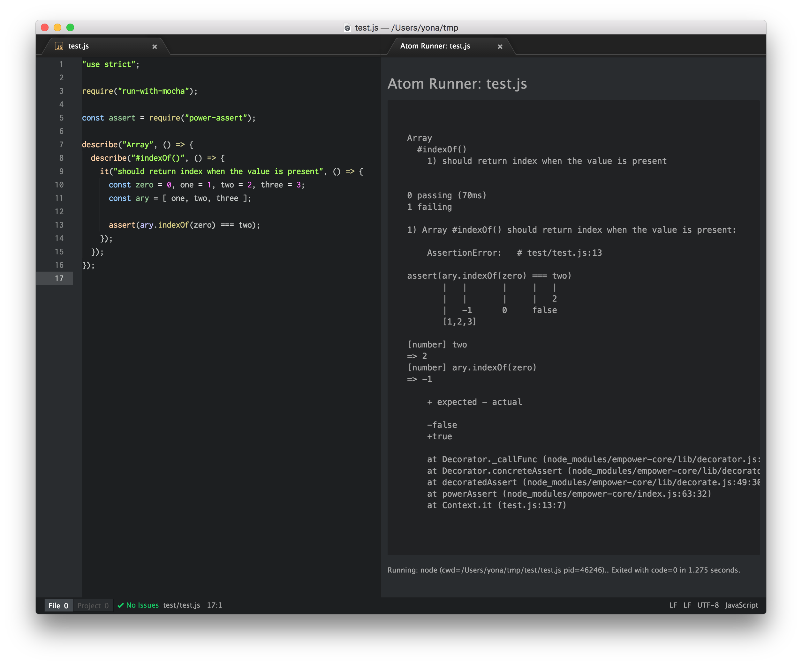

# run-with-mocha
[](https://travis-ci.org/mohayonao/run-with-mocha)
[](https://www.npmjs.org/package/run-with-mocha)
[](http://mohayonao.mit-license.org/)

> run a script with [mocha](https://mochajs.org/) without `mocha` command

If run a script without `mocha` command, `run-with-mocha` re-executes the script with `mocha` command.
So, you can run tests directly without `mocha` command.
I use this module for quick testing using [atom-runner](https://atom.io/packages/atom-runner) (Ctrl-R).



## Installation

```
npm install --save mocha run-with-mocha
```

## Example

```js
"use strict";

require("run-with-mocha");

const assert = require("assert");

describe("Array", () => {
  describe("#indexOf()", () => {
    it("should return index when the value is present", () => {
      const ary = [ 1, 2, 3 ];

      assert(ary.indexOf(0) === 2);
    });
  });
});
```

## License

MIT
